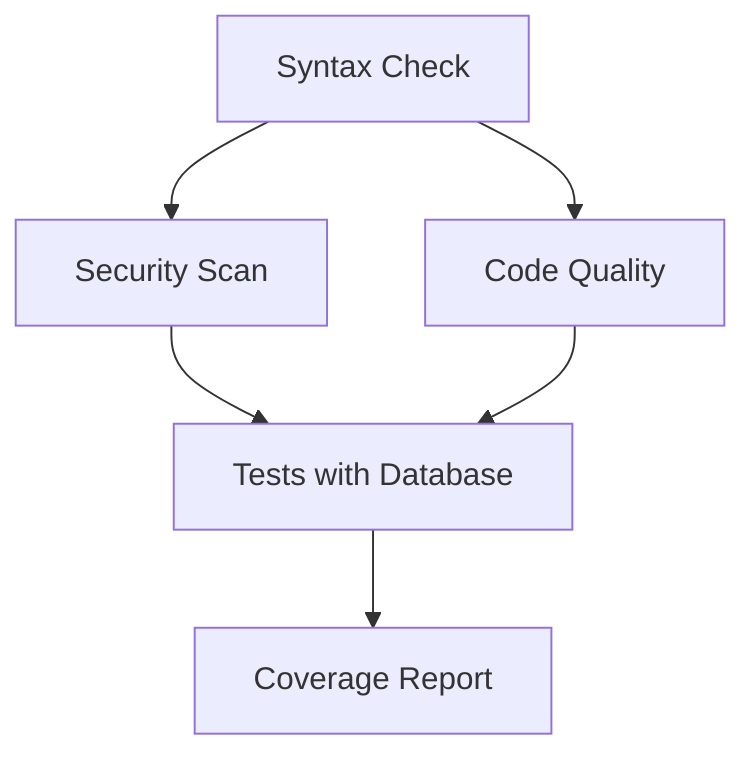

# Pipeline CI GLPI - Guide Complet

##  Aperçu du Pipeline

Le pipeline CI système d'intégration continue robuste et complet.

###  Ce qui a été ajouté

#### 1. **Tests Complets**
- Tests unitaires avec PHPUnit
- Tests d'intégration avec base de données MySQL 8.0
- Tests fonctionnels
- Couverture de code avec Codecov
- Bootstrap de test personnalisé

#### 2. **Qualité de Code**
- Analyse statique avec PHPStan (niveau 5)
- Standards de code avec PHP_CodeSniffer (PSR-12)
- Configuration personnalisée pour GLPI
- Exclusions intelligentes (vendor, legacy code)

#### 3. **Sécurité**
- Audit des dépendances Composer
- Scan de vulnérabilités automatique
- Vérification des packages tiers

#### 4. **Base de Données**
- Tests avec MySQL 8.0 en service Docker
- Configuration de test isolée
- Migrations et setup automatiques
- Variables d'environnement sécurisées

## 📁 Architecture des Fichiers

```
├── .github/workflows/
│   └── ci.yml (pipeline principal)
├── tests/
│   ├── bootstrap.php (configuration tests)
│   ├── Unit/UserTest.php (exemple test)
│   ├── Integration/ (tests DB)
│   └── Functional/ (tests E2E)
├── .githooks/
│   └── pre-commit (hooks qualité)
├── phpunit.xml.dist (config PHPUnit)
├── phpstan.neon.dist (config analyse statique)
├── phpcs.xml.dist (config standards code)
├── docker-compose.test.yml (environnement test)
├── Makefile (automatisation)
└── docs/CI-PIPELINE.md (cette doc)
```

##  Flux du Pipeline

### Jobs Parallèles (après syntax-check)



#### Job 1: Syntax & Validation
- **Quoi**: Vérification syntaxe PHP + validation Composer
- **Comment**: `php -l` sur tous les fichiers PHP + `composer validate`
- **Pourquoi**: Détection rapide des erreurs de base

#### Job 2: Security Analysis
- **Quoi**: Audit de sécurité des dépendances
- **Comment**: `composer audit` + scan des vulnérabilités
- **Pourquoi**: Prévention des failles de sécurité

#### Job 3: Code Quality
- **Quoi**: Standards PSR-12 + analyse statique PHPStan
- **Comment**: PHPCS pour le style, PHPStan niveau 5 pour la logique
- **Pourquoi**: Maintien de la qualité et détection des bugs potentiels

#### Job 4: Tests with Database
- **Quoi**: Tests complets avec MySQL réel
- **Comment**: Service MySQL Docker + PHPUnit + couverture Xdebug
- **Pourquoi**: Validation fonctionnelle avec environnement réaliste

## 🛠️ Utilisation Quotidienne

### Commandes Make disponibles

```bash
make help           # Affiche l'aide complète
make install        # Installe les dépendances
make test          # Lance tous les tests
make test-unit     # Tests unitaires seulement
make lint          # Vérifie le style de code
make lint-fix      # Corrige automatiquement le style
make analyze       # Analyse statique PHPStan
make security      # Audit de sécurité
make quality       # Tous les contrôles qualité
make ci            # Simulation complète du CI
make clean         # Nettoie les fichiers temporaires
make docker-test   # Tests avec Docker
```

### Hooks Git Pre-commit

```bash
# Activation des hooks
git config core.hooksPath .githooks

# Le hook vérifie automatiquement:
# - Syntaxe PHP
# - Standards de code
# - Analyse statique (warnings)
# - Sécurité (warnings)
```

## 🔧 Configuration Technique

### Base de données de test

```yaml
MySQL 8.0:
  - Database: glpi_test
  - User: glpi_user
  - Password: glpi_pass
  - Port: 3306
  - Health checks automatiques
```

### Extensions PHP requises

```
Obligatoires:
- dom, curl, libxml, mbstring, zip
- pdo, mysqli (base de données)
- intl, gd, exif (GLPI spécifique)

Outils:
- xdebug (couverture de code)
- composer, phpunit, phpstan
```

### Configuration PHPStan

```yaml
Niveau: 5 (équilibre performance/précision)
Exclusions:
- vendor/ (dépendances tierces)
- tests/ (code de test)
- files/ (données utilisateur)
- plugins/ (code externe)
```

##  Métriques et Rapports

### Couverture de Code
- **Format**: Clover XML + HTML
- **Upload**: Codecov automatique
- **Seuils**: Configurables par projet

### Qualité de Code
- **PHPStan**: Analyse statique niveau 5
- **PHPCS**: Standards PSR-12 avec adaptations GLPI
- **Rapports**: Intégrés dans GitHub Actions

### Sécurité
- **Composer Audit**: Vulnérabilités des dépendances
- **Format**: JSON pour intégration
- **Fréquence**: À chaque push/PR

## 🚨 Gestion des Échecs

### Stratégie de Tolérance
- **Syntaxe PHP**: Échec bloquant
- **Standards de code**: Échec bloquant
- **Analyse statique**: Warnings seulement
- **Sécurité**: Warnings seulement
- **Tests**: Échec bloquant

### Debugging

```bash
# Logs locaux
make ci 2>&1 | tee ci-debug.log

# Tests spécifiques
make test-unit FILTER=UserTest

# Analyse détaillée
make analyze --verbose
```

##  Workflow de Développement

### Branches et Déclencheurs

```
Push sur:
- main, master, develop → CI complet

Pull Request vers:
- main, master → CI complet + review obligatoire

Hooks locaux:
- pre-commit → Contrôles rapides
```

### Processus de Développement

1. **Développement**: Branche `feature/nom-feature`
2. **Tests locaux**: `make ci` avant commit
3. **Commit**: Hooks pre-commit automatiques
4. **Push**: Déclenchement du CI GitHub
5. **Pull Request**: Review + CI obligatoires
6. **Merge**: Après validation complète

##  Améliorations Apportées

### Avant (Pipeline Original)
```yaml
- Syntaxe PHP basique
- Validation Composer simple
- Pas de tests
- Pas de qualité de code
- Pas de sécurité
```

### Après (Pipeline Amélioré)
```yaml
- 4 jobs parallèles
- Tests avec MySQL réel
- Analyse statique complète
- Audit de sécurité
- Couverture de code
- Hooks Git automatiques
- Documentation complète
```

##  Bénéfices Concrets

### Pour les Développeurs
- **Feedback rapide**: Erreurs détectées avant merge
- **Qualité garantie**: Standards automatiquement vérifiés
- **Sécurité**: Vulnérabilités détectées tôt
- **Confiance**: Tests automatisés complets

### Pour le Projet
- **Stabilité**: Réduction des bugs en production
- **Maintenabilité**: Code standardisé et documenté
- **Sécurité**: Audit continu des dépendances
- **Performance**: Optimisations guidées par les métriques

##  Évolutions Futures Possibles

### Tests Avancés
- [ ] Tests de performance avec benchmarks
- [ ] Tests de charge avec K6
- [ ] Tests E2E avec Cypress/Playwright
- [ ] Tests de régression visuelle

### Qualité Avancée
- [ ] Analyse de complexité cyclomatique
- [ ] Détection de code mort
- [ ] Métriques de maintenabilité
- [ ] Analyse de dépendances

### Intégrations
- [ ] SonarQube pour analyse continue
- [ ] Dependabot pour mises à jour auto
- [ ] Monitoring de performance
- [ ] Notifications Slack/Teams